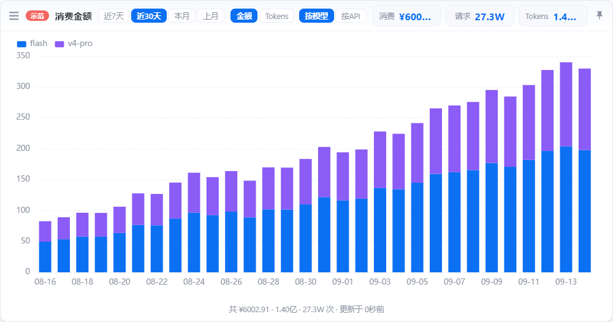

# DS侧栏

> 贴在屏幕边上的 DeepSeek 用量细条 —— 瞄一眼就知道余额多少、今天花了多少、现在是高峰还是低谷。

侧边吸附 + 鼠标划过自动滑出，不占地方、不进任务栏。




> 截图取自内置的**演示模式**（数据全部伪造），所以数字不必当真。

## 功能

**细条视图**（平时收起的样子）

| 位置 | 内容 |
| --- | --- |
| 模型 | 显示当前模型，点击可切换（全部 / 单个模型） |
| 余额 | 账户余额 |
| 高峰/低谷 | 按北京时间自动切换，鼠标悬停可看计费规则和"还有多久切换" |
| 今日 | 今日消费金额 + tokens，点击可切换不同 API Key |

**图表视图**（展开后）

- 按模型 / 按 API Key 分层堆叠条形图，hover 显示每一层的金额和 tokens
- 范围：近 7 天 / 近 30 天 / 本月 / 上月
- 指标：金额 / Tokens
- 顶部三个统计卡：区间总消费、请求次数、总 tokens

**其他**

- 侧边吸附、屏幕边缘触点自动隐藏与展开、托盘驻留（无任务栏图标，X 关闭回托盘）
- 设置里可调主题、透明度、自动吸附、自动隐藏延时、触点大小与颜色
- 统计筛选：搜关键词、勾选要计入的 API Key

## 峰谷计费

DeepSeek 采用峰谷分时定价，本工具会自动显示当前处于哪一档：

| 时段 | 时间（北京时间） | 单价 |
| --- | --- | --- |
| 🔴 高峰 | **工作日**（周一至周五）09:00-12:00、14:00-18:00 | 高峰价 |
| 🟢 低谷 | 其余全部时段，**含周六周日全天** | 高峰价的一半 |

> 注意周末不算高峰——批量任务、跑量任务排在晚上和周末最省。

## 数据源与凭证

| 数据 | 接口 | 凭证 |
| --- | --- | --- |
| 余额 | `platform.deepseek.com/api/v0/users/get_user_summary` | User Token |
| 用量（按 API × 模型 × 天） | `platform.deepseek.com/api/v0/usage/by_api_key/{amount,cost}` | User Token |
| API Key 列表 | `platform.deepseek.com/api/v0/users/get_api_keys` | User Token |

**只需要 User Token 一种凭证。** 不需要填 API Key，余额也是走平台接口（和网页右上角显示的是同一个数）。设置里点「一键登录」会自动开一个登录窗口，登录后自动抓取并保存 token。

User Token 是账户级凭证，能统计该账户下所有 API Key 的用量。

## 隐私

- 凭证只存在本地配置文件里，**不会上传任何地方**；请求只发给 `platform.deepseek.com`。
- 落盘前用系统级加密（Windows DPAPI / macOS Keychain）加密，配置文件里没有明文 token。
- **演示模式**（`DS_DEMO=1`）下所有展示数字都是伪造的，用于截图、录屏或给别人看，不会暴露真实花销。
- **纯净模式**（`DS_CLEAN_MODE=1`）下完全不读 `~/.claude` 目录，只用应用内自己保存的凭证。

## 运行

需要 Node.js 18+（用到内置 `fetch`）。

```bash
npm install
npm start
```

启动后会吸附到屏幕右边缘，自动收成一条蓝色细触点；鼠标划过触点即可滑出。

打包成免安装绿色版：

```bash
npm run dist          # → dist/DS侧栏-win32-x64/
```

绿色版的配置跟着 exe 走（`exe 同目录/config/state.json`）。打包后自动复制到指定目录：

```bash
DS_DEPLOY_DIR="D:/软件/DS侧栏" npm run dist
```

部署会清空重建目标目录（避免残留旧文件），但会**保留其中的 `config/`**，所以更新版本不需要重新登录。如果应用正在运行导致 `config/` 挪不动，脚本会提示，这次更新后需要重新登录一次。

## 技术栈

- Electron 31 — 无边框透明窗口、托盘、屏幕吸附
- ECharts 5 — 堆叠条形图（离线打包在 `src/renderer/vendor/`）
- Node.js 内置 `fetch` — 直连平台接口，无第三方 HTTP 依赖

## 项目结构

```
src/
  main/              主进程
    main.js            入口：单实例、窗口、托盘、定时刷新、IPC
    window-manager.js  主窗口与触点窗口、吸附边界计算
    snap-manager.js    吸附 / 折叠触点 / 悬浮展开
    ds-api.js          数据层：余额 + 用量（按 API × 模型 × 天）
    store.js           状态持久化（窗口位置、视图、设置）
    credential-store.js 凭证加解密
    demo.js            演示模式的伪造数据
  renderer/          渲染层（细条 / 图表 / 菜单 / 触点）
  shared/pricing.js  峰谷计费规则（主进程与渲染层共用同一份）
```

## 免责声明

本项目为**非官方**客户端，使用 DeepSeek 平台的网页私有接口（`platform.deepseek.com/api/v0/...`），仅供个人学习与自用。接口字段、地址可能随平台调整而失效，请谨慎使用。使用过程中产生的账户风险由使用者自行承担，与 DeepSeek 官方无关。

## License

MIT
